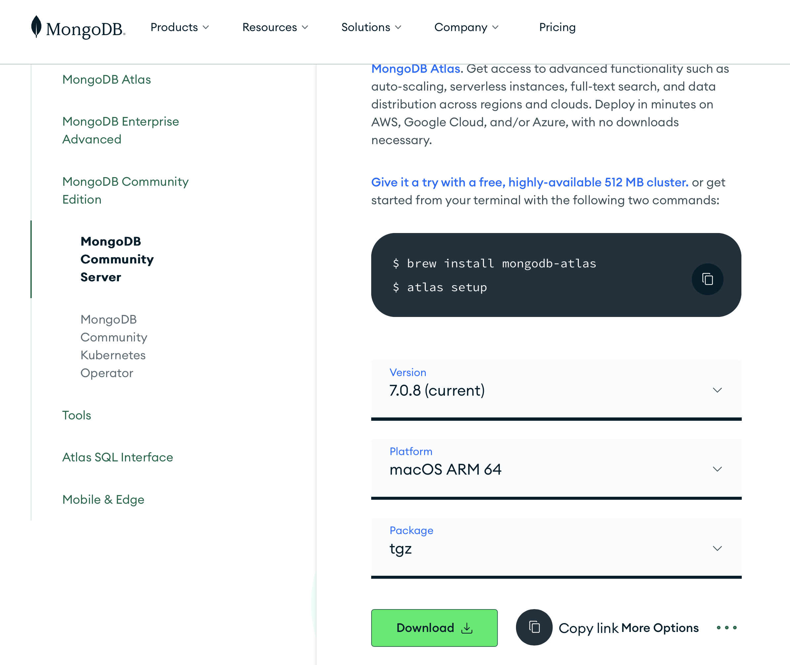
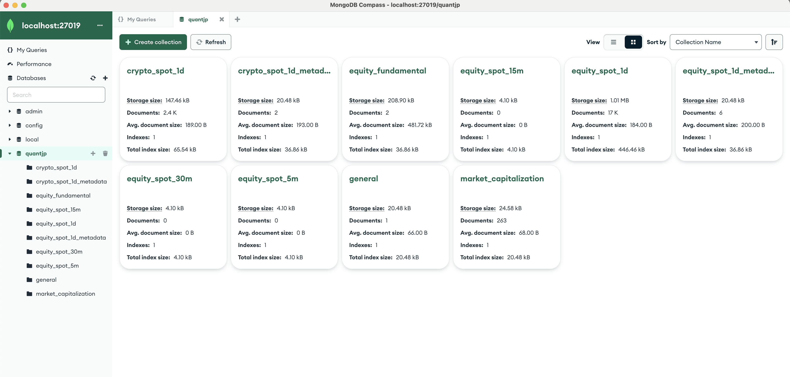

# Installation MongoDB: Installation and Setup

In this blog post, we'll walk through the process of downloading, installing, and setting up MongoDB on your local machine. We'll also explore how to create a database, user, and run some basic operations using scripts.

## Prerequisites

Before we begin, make sure you have the following:

- A computer running macOS, Linux, or Windows
- Basic knowledge of the command line interface (CLI)

## Step 1: Download MongoDB

1. Visit the official MongoDB website: [https://www.mongodb.com/try/download/community](https://www.mongodb.com/try/download/community)
2. Choose your operating system and download the appropriate version of MongoDB Community Server.
3. Follow the installation instructions for your operating system.



## Step 2: Install MongoDB

1. Once the download is complete, open the downloaded package and follow the installation wizard.
2. Choose the installation directory and click "Next".
3. Select the components you want to install (default options are usually sufficient) and click "Next".
4. Choose whether to run MongoDB as a service and click "Next".
5. Click "Install" to start the installation process.

## Step 3: Set Up Environment Variables

1. Add the MongoDB `bin` directory to your system's `PATH` environment variable. This allows you to run MongoDB from anywhere in the terminal.
   - On macOS and Linux, add the following line to your `.bash_profile` or `.bashrc` file:
```bash
     export PATH=<mongodb-install-directory>/bin:$PATH
```
   - On Windows, add the `<mongodb-install-directory>\bin` directory to the `PATH` variable through the Environment Variables settings.

## Step 4: Run the MongoDB Server

1. Open a terminal or command prompt.
2. Create a directory for storing MongoDB data:


```bash
   mkdir -p /path/to/mongodb/data
```


3. Start the MongoDB server by running the following command:   
```bash
    mongod --dbpath /path/to/mongodb/data
```


4.  Run the Setup Scripts
Now that MongoDB is up and running, let's use the provided scripts to create a database, user, and perform some basic operations.

5. Save the create_mongodb.sh script to a file.
6. Open a new terminal or command prompt.
7. Navigate to the directory where you saved the script.

8. Make the script executable by running:

```bash
    chmod +x create_mongodb.sh
```

9. Execute the script:
```bash
    ./create_mongodb.sh
```
This script will connect to the MongoDB server, create a database named "quantjp", create a user with the specified credentials, and insert a sample document into the "general" collection.

The scrips looks like:

```bash title="create_mongodb.sh"
#!/bin/bash

# Set MongoDB connection details
MONGO_DB="quantjp"
MONGO_USER="<user>"
MONGO_PW="<password>"
MONGO_ADMIN_PW="<password>>"
MONGO_CLUSTER="localhost:27019"

# Connect to MongoDB admin database
mongosh "$MONGO_CLUSTER/admin" <<EOF
  // Enable access control
  db.runCommand({ setParameter: 1, authenticationMechanisms: 'SCRAM-SHA-256' })

  // Create admin user
  db.createUser({
    user: 'admin',
    pwd: '$MONGO_ADMIN_PW',
    roles: [
      { role: 'userAdminAnyDatabase', db: 'admin' },
      { role: 'dbAdminAnyDatabase', db: 'admin' },
      { role: 'clusterAdmin', db: 'admin' }
    ]
  })

  // Authenticate as admin user
  db.auth('admin', '$MONGO_ADMIN_PW')

  // Create the database (it will be created automatically when it's used the first time)
  use $MONGO_DB

  // Create user with specified username and password
  db.createUser({
    user: "$MONGO_USER",
    pwd: "$MONGO_PW",
    customData: { appName: "quantjp" },
    roles: [
      { role: "readWrite", db: "$MONGO_DB" }
    ]
  })

  // Create a sample collection and insert a document to ensure the database is created
  db.createCollection("general")
  db.general.insertOne({ message: "Database created successfully." })
EOF
```

10. Save the start_mongodb.sh script to a file and make the script executable by running:
```bash
    chmod +x start_mongodb.sh
```
 11. Execute the script:
```bash
    ./start_mongodb.sh
```
This script will start the MongoDB server with the specified data directory and log file.

The script looks like:

```bash title="start_mongodb.sh"
#!/bin/bash

# Set the data directory path
DATA_DIR="/Users/jakub/Documents/@Jakub/@1Projects/QuantJP/_data/mongodb"

# Set the log directory path
LOG_DIR="/Users/jakub/Documents/@Jakub/@1Projects/QuantJP/_logs"

# Create the data directory if it doesn't exist
mkdir -p "$DATA_DIR"

# Create the log directory if it doesn't exist
mkdir -p "$LOG_DIR"

# Start MongoDB with the specified data directory and log file on localhost port 27019
mongod --dbpath "$DATA_DIR" --logpath "$LOG_DIR/mongodb.log" --logappend --port 27019 --bind_ip localhost
```


Congratulations! You have successfully installed MongoDB, created a database, user, and performed some basic operations using scripts.

## Step 5: Checking MongoDB 

Let's check how it works:
the best would be to download MongoDB Compass from 'https://www.mongodb.com/products/tools/compass'
and when you run it connect to DB with:
 ```
    mongodb://localhost:27017/
 ```

Then you should see 


Please note I have here more DBs (collections), which we will create running our Framework.

##Conclusion
In this blog post, we covered the steps to download, install, and set up MongoDB on your local machine. We also explored how to use scripts to automate the process of creating a database, user, and running basic operations. With MongoDB up and running, you're now ready to start building applications that leverage its powerful features.


