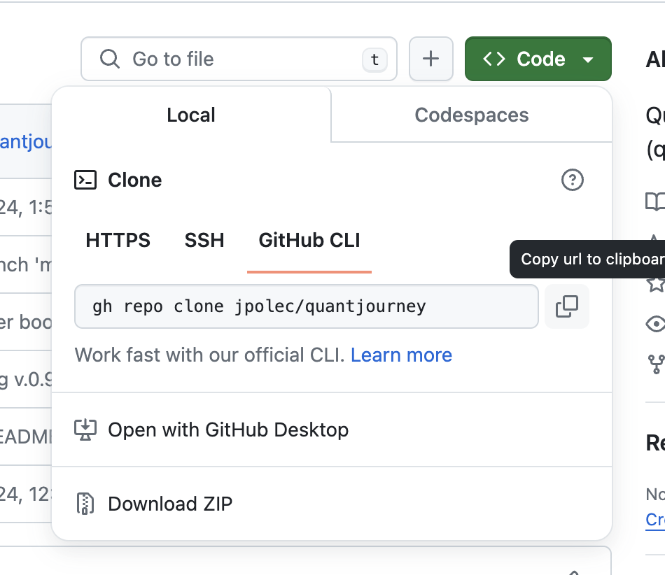

# Getting a Repository from GitHub

This guide will help you clone a repository from GitHub, unpack the contents if necessary, and handle files with specific patterns.

## Cloning a Repository

To clone a repository, you need to have Git installed on your machine. If you don't have Git installed, you can download it from [Git SCM](https://git-scm.com/).

1. **Open your terminal:** You can do this by searching for `cmd` in Windows, `Terminal` in macOS, or `Terminal` in Linux distributions.
2. **Navigate to the directory where you want to clone the repository:** Use the `cd` command to change to the desired directory. For example:
```bash
   cd path/to/your/folder

   git clone https://github.com/username/repository.git
```

Replace https://github.com/username/repository.git with the actual URL of the GitHub repository.



This command downloads the repository and its entire version history.
Unpacking and Handling Specific Files
After cloning the repository, you might need to unpack files or handle files with specific patterns, such as those starting with 're...'.

Unpack files (if applicable): If the repository includes compressed files (like ZIP or TAR files), you can use a command or software to unpack them. For example, to unpack a ZIP file in Linux or macOS.


When setting up the project on a new machine or environment, you can install all dependencies from this file:
```bash
pip install -r requirements.txt
```
Using a virtual environment in Python projects helps manage dependencies efficiently and keeps your project organized. Always activate your virtual environment before working on your project to ensure you're using the right versions of your dependencies.